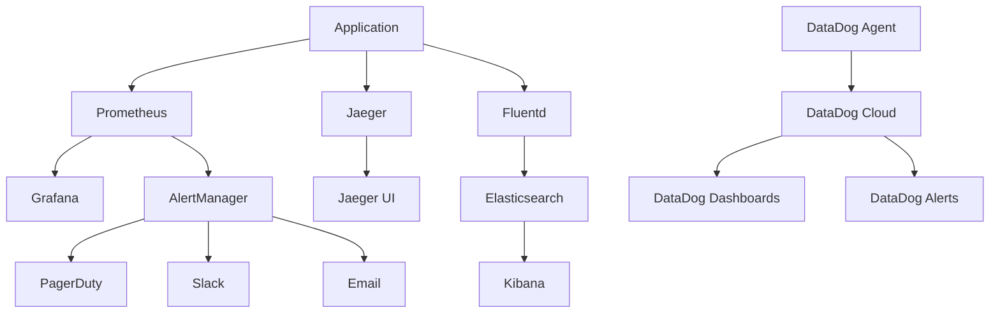

# Monitoring and Alerting Operations Guide

This guide provides comprehensive information on monitoring and alerting systems for Alchemorsel v3, including setup, maintenance, and troubleshooting procedures.

## 🎯 Monitoring Overview

### Monitoring Stack
- **Prometheus**: Metrics collection and storage
- **Grafana**: Visualization and dashboards
- **Jaeger**: Distributed tracing
- **ELK Stack**: Log aggregation and analysis
- **DataDog**: External monitoring and alerting

### Key Metrics Categories
1. **Infrastructure Metrics**: CPU, memory, disk, network
2. **Application Metrics**: Response times, error rates, throughput
3. **Business Metrics**: User activity, conversion rates
4. **Security Metrics**: Failed logins, anomalous behavior

## 📊 Monitoring Architecture



## 🔧 Prometheus Configuration

### Core Metrics Collection
```yaml
# prometheus.yml
global:
  scrape_interval: 15s
  evaluation_interval: 15s

rule_files:
  - "alert_rules.yml"
  - "recording_rules.yml"

scrape_configs:
  - job_name: 'alchemorsel-api'
    static_configs:
      - targets: ['alchemorsel-api:8080']
    metrics_path: /metrics
    scrape_interval: 15s
    
  - job_name: 'alchemorsel-web'
    static_configs:
      - targets: ['alchemorsel-web:9113']
    metrics_path: /metrics
    scrape_interval: 30s
    
  - job_name: 'kubernetes-pods'
    kubernetes_sd_configs:
      - role: pod
    relabel_configs:
      - source_labels: [__meta_kubernetes_pod_annotation_prometheus_io_scrape]
        action: keep
        regex: true
```

### Recording Rules
```yaml
# recording_rules.yml
groups:
  - name: alchemorsel.rules
    rules:
      - record: alchemorsel:http_request_rate_5m
        expr: rate(http_requests_total[5m])
        
      - record: alchemorsel:http_request_error_rate_5m
        expr: rate(http_requests_total{status_code=~"5.."}[5m]) / rate(http_requests_total[5m])
        
      - record: alchemorsel:http_request_duration_p95_5m
        expr: histogram_quantile(0.95, rate(http_request_duration_seconds_bucket[5m]))
        
      - record: alchemorsel:database_connection_usage
        expr: database_connections_active / database_connections_max * 100
```

### Alert Rules
```yaml
# alert_rules.yml
groups:
  - name: alchemorsel.alerts
    rules:
      - alert: HighErrorRate
        expr: alchemorsel:http_request_error_rate_5m > 0.05
        for: 2m
        labels:
          severity: critical
        annotations:
          summary: "High error rate detected"
          description: "Error rate is {{ $value | humanizePercentage }} for the last 5 minutes"
          
      - alert: HighResponseTime
        expr: alchemorsel:http_request_duration_p95_5m > 1
        for: 5m
        labels:
          severity: warning
        annotations:
          summary: "High response time detected"
          description: "95th percentile response time is {{ $value }}s"
          
      - alert: DatabaseConnectionsHigh
        expr: alchemorsel:database_connection_usage > 80
        for: 2m
        labels:
          severity: warning
        annotations:
          summary: "Database connection pool usage high"
          description: "Database connections at {{ $value }}% of maximum"
          
      - alert: PodCrashLooping
        expr: rate(kube_pod_container_status_restarts_total[15m]) > 0
        for: 5m
        labels:
          severity: critical
        annotations:
          summary: "Pod is crash looping"
          description: "Pod {{ $labels.pod }} in namespace {{ $labels.namespace }} is restarting"
```

## ⚡ Alert Management Procedures

### Alert Severity Levels

#### Critical (Immediate Response)
- Service completely down
- Data corruption detected
- Security breach indicators
- Database connection failures

**Response Time**: 5 minutes  
**Escalation**: Immediate PagerDuty notification

#### Warning (Within 30 minutes)
- Performance degradation
- High error rates (>2%)
- Resource usage >80%
- Failed deployments

**Response Time**: 30 minutes  
**Escalation**: Slack notification, email backup

#### Info (Next business day)
- Minor performance issues
- Low disk space warnings
- Certificate expiration (>30 days)

**Response Time**: Next business day  
**Escalation**: Email only

### Alert Response Workflow

1. **Acknowledge Alert** (1 minute)
   ```bash
   # Acknowledge in PagerDuty/Slack
   # Check monitoring dashboards
   # Verify alert is legitimate
   ```

2. **Initial Assessment** (2-3 minutes)
   ```bash
   # Check service health
   curl -f https://alchemorsel.com/health
   
   # Check infrastructure
   kubectl get pods -n alchemorsel
   
   # Check recent changes
   kubectl rollout history deployment/alchemorsel-api -n alchemorsel
   ```

3. **Triage and Response** (5-15 minutes)
   - Determine root cause
   - Apply immediate fixes
   - Escalate if needed

4. **Resolution and Follow-up**
   - Verify fix
   - Update stakeholders
   - Schedule post-mortem if needed

### Common Alert Resolutions

#### High Response Time
```bash
# Check pod resources
kubectl top pods -n alchemorsel

# Scale up if needed
kubectl scale deployment alchemorsel-api --replicas=6 -n alchemorsel

# Check for memory leaks
kubectl logs -l app.kubernetes.io/name=alchemorsel-api -n alchemorsel | grep -i "memory\|leak"
```

#### High Error Rate
```bash
# Check error logs
kubectl logs -l app.kubernetes.io/name=alchemorsel-api -n alchemorsel | grep "ERROR\|FATAL"

# Check database connectivity
kubectl run db-test --rm -i --tty --image=postgres:15 -- \
  psql $DATABASE_URL -c "SELECT version();"

# Rollback if recent deployment
kubectl rollout undo deployment/alchemorsel-api -n alchemorsel
```

#### Database Issues
```bash
# Check RDS status
aws rds describe-db-instances --db-instance-identifier alchemorsel-prod

# Check connection pool
kubectl logs -l app.kubernetes.io/name=alchemorsel-api -n alchemorsel | grep "connection\|pool"

# Check slow queries
psql $DATABASE_URL -c "SELECT query, calls, mean_time FROM pg_stat_statements ORDER BY mean_time DESC LIMIT 10;"
```

## 🛠️ Maintenance Tasks

### Daily Tasks
- [ ] Check alert summary
- [ ] Review error logs
- [ ] Verify backup completion
- [ ] Check certificate expiration

### Weekly Tasks
- [ ] Review performance trends
- [ ] Update alert thresholds if needed
- [ ] Clean up old logs
- [ ] Validate monitoring coverage

### Monthly Tasks
- [ ] Review and optimize queries
- [ ] Update monitoring configurations
- [ ] Capacity planning review
- [ ] Security metrics review

### Quarterly Tasks
- [ ] Monitoring strategy review
- [ ] Tool evaluation and updates
- [ ] Alert fatigue analysis
- [ ] Performance baseline updates

## 📞 Escalation Procedures

### Level 1: On-Call Engineer
- Respond to alerts within SLA
- Basic troubleshooting
- Apply standard fixes

### Level 2: Senior Engineer/Team Lead
- Complex troubleshooting
- Architecture decisions
- Cross-team coordination

### Level 3: Engineering Manager
- Resource allocation
- Vendor escalation
- Customer communication

### Level 4: CTO/VP Engineering
- Strategic decisions
- Major incident management
- Executive communication

---

This monitoring and alerting guide ensures comprehensive observability and rapid incident response for Alchemorsel v3.