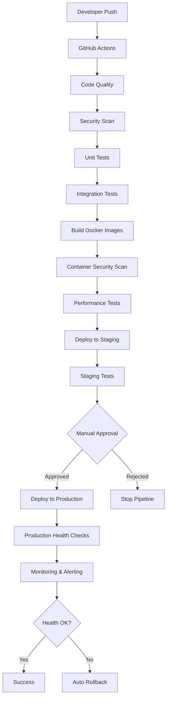

# CI/CD Pipeline Overview

This document provides a comprehensive overview of the Alchemorsel v3 CI/CD pipeline architecture, stages, and workflow.

## 🏗️ Pipeline Architecture



## 🔄 Pipeline Stages

### 1. Source Control Trigger
**Duration**: Instant  
**Purpose**: Trigger pipeline on code changes

#### Triggers
- Push to `main` branch
- Pull requests to `main`
- Manual workflow dispatch
- Scheduled security scans (daily)

#### Branch Protection Rules
- Required status checks
- Require branches to be up to date
- Require pull request reviews (2 reviewers)
- Dismiss stale reviews
- Restrict pushes to admins only

### 2. Code Quality Analysis
**Duration**: 2-3 minutes  
**Purpose**: Ensure code quality and consistency

#### Quality Checks
- **golangci-lint**: Go code linting
- **gofmt**: Code formatting verification
- **go vet**: Static analysis
- **ineffassign**: Unused variable detection
- **misspell**: Spell checking

#### Quality Gates
- All linters must pass
- Code coverage >90% for critical paths
- No security vulnerabilities in code

### 3. Security Scanning (SAST)
**Duration**: 3-5 minutes  
**Purpose**: Static Application Security Testing

#### Security Tools
- **Gosec**: Go security analyzer
- **Semgrep**: Multi-language static analysis
- **CodeQL**: GitHub's semantic code analysis
- **TruffleHog**: Secrets detection
- **Bandit**: Python security scanner (for scripts)

#### Security Gates
- No critical or high severity issues
- No secrets in code
- Compliance with security policies

### 4. Unit Testing
**Duration**: 5-8 minutes  
**Purpose**: Verify individual components

#### Test Types
- **Unit Tests**: Individual function testing
- **Table-driven Tests**: Multiple input scenarios
- **Mock Testing**: External dependency mocking
- **Benchmark Tests**: Performance benchmarking

#### Coverage Requirements
- Overall coverage: >85%
- Critical path coverage: >95%
- New code coverage: >90%

### 5. Integration Testing
**Duration**: 8-12 minutes  
**Purpose**: Test component interactions

#### Test Environment
- PostgreSQL 15 container
- Redis 7 container
- Ollama AI service
- Test data fixtures

#### Integration Scenarios
- Database operations
- Redis caching
- AI service integration
- External API interactions
- Authentication flows

### 6. Build and Package
**Duration**: 10-15 minutes  
**Purpose**: Create deployable artifacts

#### Build Process
1. **Multi-stage Docker build**
   - Go application compilation
   - Frontend asset building
   - Security scanning of binaries
   - Distroless final image

2. **Multi-platform builds**
   - linux/amd64
   - linux/arm64

3. **Artifact generation**
   - Docker images
   - Binary releases
   - SBOM (Software Bill of Materials)

#### Optimization
- Build caching with GitHub Actions cache
- Layer caching for Docker builds
- Parallel builds for different platforms

### 7. Container Security Scanning
**Duration**: 3-5 minutes  
**Purpose**: Scan container images for vulnerabilities

#### Security Tools
- **Trivy**: Comprehensive vulnerability scanner
- **Grype**: Container image scanner
- **Docker Scout**: Docker's security scanning
- **Syft**: SBOM generation

#### Vulnerability Management
- Critical: Block deployment
- High: Require approval
- Medium/Low: Log and track

### 8. Performance Testing
**Duration**: 10-15 minutes  
**Purpose**: Validate application performance

#### Test Types
- **Load Testing**: Normal traffic simulation
- **Stress Testing**: Peak load validation
- **Spike Testing**: Traffic burst handling
- **Volume Testing**: Large dataset processing

#### Performance Gates
- Response time P95 < 1000ms
- Error rate < 1%
- Throughput meets SLA
- Resource utilization within limits

### 9. Staging Deployment
**Duration**: 3-5 minutes  
**Purpose**: Deploy to staging environment

#### Deployment Process
1. **Infrastructure validation**
   - Terraform plan execution
   - Resource health checks

2. **Application deployment**
   - Kubernetes manifest application
   - Rolling update strategy
   - Health check validation

3. **Smoke testing**
   - Basic functionality verification
   - API endpoint testing
   - Database connectivity

### 10. Staging Validation
**Duration**: 5-10 minutes  
**Purpose**: Comprehensive staging testing

#### Test Suites
- **End-to-End Tests**: Full user workflows
- **API Tests**: Complete API functionality
- **Database Migration Tests**: Schema changes
- **Security Tests**: DAST scanning with OWASP ZAP

#### Validation Criteria
- All E2E tests pass
- API tests complete successfully
- Security scan shows no new issues
- Performance within acceptable range

### 11. Production Gate
**Duration**: Variable (manual)  
**Purpose**: Human approval for production deployment

#### Approval Requirements
- Senior engineer approval
- Security team sign-off (for security changes)
- Product owner approval (for feature changes)

#### Automated Checks
- Staging deployment successful
- All tests passing
- Security scans clear
- Performance metrics acceptable

### 12. Production Deployment
**Duration**: 5-8 minutes  
**Purpose**: Deploy to production with zero downtime

#### Deployment Strategy: Blue-Green
1. **Prepare green environment**
   - Deploy new version to green slots
   - Validate deployment health
   - Run smoke tests

2. **Traffic switch**
   - Update load balancer configuration
   - Gradual traffic shifting (if canary enabled)
   - Monitor key metrics

3. **Validation**
   - Health checks on new deployment
   - Performance monitoring
   - Error rate monitoring

#### Rollback Triggers
- Health check failures
- Error rate above threshold
- Performance degradation
- Manual intervention

### 13. Post-Deployment Monitoring
**Duration**: Continuous  
**Purpose**: Monitor application health and performance

#### Monitoring Areas
- **Application Health**: Service availability and responsiveness
- **Performance Metrics**: Response times, throughput, resource usage
- **Business Metrics**: User engagement, conversion rates
- **Security Monitoring**: Threat detection, anomaly analysis

#### Alerting
- **Critical**: Immediate PagerDuty notification
- **Warning**: Slack notification
- **Info**: Dashboard update

## 🚀 Deployment Strategies

### Development Environment
- **Trigger**: Every commit to feature branches
- **Strategy**: Direct deployment
- **Validation**: Unit tests only
- **Rollback**: Manual

### Staging Environment
- **Trigger**: Merge to develop branch
- **Strategy**: Rolling deployment
- **Validation**: Full test suite
- **Rollback**: Automated on failure

### Production Environment
- **Trigger**: Manual approval after staging validation
- **Strategy**: Blue-green deployment
- **Validation**: Comprehensive monitoring
- **Rollback**: Automated on health check failure

## 🎯 Quality Gates Summary

| Stage | Quality Gate | Threshold | Action on Failure |
|-------|--------------|-----------|-------------------|
| Code Quality | Linting | 0 issues | Block pipeline |
| Security (SAST) | Vulnerabilities | 0 critical/high | Block pipeline |
| Unit Tests | Coverage | >85% overall, >95% critical | Block pipeline |
| Integration Tests | Pass Rate | 100% | Block pipeline |
| Container Security | Vulnerabilities | 0 critical | Block pipeline |
| Performance | Response Time | P95 < 1000ms | Block pipeline |
| Performance | Error Rate | <1% | Block pipeline |
| Staging Tests | Pass Rate | 100% | Block pipeline |
| Production Health | Availability | >99.9% | Auto rollback |

## 📊 Pipeline Metrics

### Performance Metrics
- **Total Pipeline Duration**: 30-45 minutes
- **Build Success Rate**: >95%
- **Deployment Frequency**: 2-3 times per day
- **Lead Time**: 4-6 hours (feature to production)

### Quality Metrics
- **Test Coverage**: >90%
- **Security Scan Coverage**: 100%
- **Vulnerability Resolution Time**: <24 hours
- **Performance Regression Rate**: <2%

### Reliability Metrics
- **Mean Time to Recovery (MTTR)**: <30 minutes
- **Change Failure Rate**: <5%
- **Deployment Success Rate**: >98%
- **Rollback Rate**: <3%

## 🔧 Pipeline Configuration

### Environment Variables
```yaml
# Global configuration
GO_VERSION: "1.23"
NODE_VERSION: "20"
REGISTRY: ghcr.io
IMAGE_NAME: ${{ github.repository }}

# Security scanning
SNYK_TOKEN: ${{ secrets.SNYK_TOKEN }}
SONAR_TOKEN: ${{ secrets.SONAR_TOKEN }}

# Deployment
AWS_ACCESS_KEY_ID: ${{ secrets.AWS_ACCESS_KEY_ID }}
KUBECONFIG: ${{ secrets.KUBECONFIG }}

# Monitoring
DATADOG_API_KEY: ${{ secrets.DATADOG_API_KEY }}
SLACK_WEBHOOK_URL: ${{ secrets.SLACK_WEBHOOK_URL }}
```

### Required Secrets
- `GITHUB_TOKEN`: GitHub API access
- `AWS_ACCESS_KEY_ID` / `AWS_SECRET_ACCESS_KEY`: AWS access
- `SNYK_TOKEN`: Snyk security scanning
- `SONAR_TOKEN`: SonarQube analysis
- `DATADOG_API_KEY`: Monitoring integration
- `SLACK_WEBHOOK_URL`: Notifications

## 🛠️ Maintenance and Updates

### Regular Maintenance
- **Weekly**: Pipeline performance review
- **Monthly**: Security tool updates
- **Quarterly**: Infrastructure optimization
- **Annually**: Technology stack evaluation

### Continuous Improvement
- Monitor pipeline performance metrics
- Gather developer feedback
- Implement optimizations
- Update tools and dependencies

### Breaking Change Management
- Gradual rollout of pipeline changes
- Feature flags for new functionality
- Rollback procedures for pipeline updates
- Communication plan for major changes

---

This pipeline is designed to ensure high-quality, secure, and reliable deployments while maintaining developer productivity and system reliability.